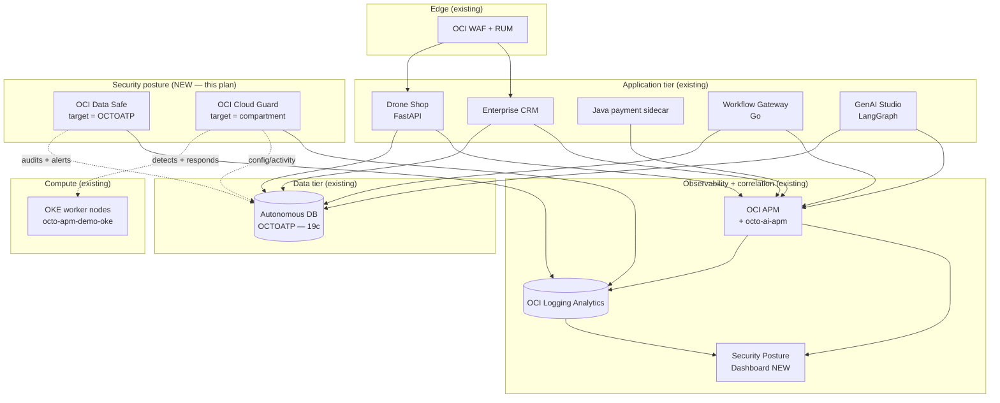

# Security Expansion Plan — OCI Data Safe + Cloud Guard

> **Status: PLAN ONLY.** This document describes the next modular expansion of
> the demo. It introduces **no live changes**. Every component is additive and
> feature-flagged so existing deploys keep working unchanged when these flags
> stay off (the default).

## 1. Why — the gap this closes

The demo today tells a strong **observability** story across three layers:

- **Application** — OCI APM traces/topology for the Drone Shop, CRM, the Java
  payment sidecar, and the workflow gateway, correlated with OCI Logging
  Analytics by `oracleApmTraceId`.
- **Database** — OPS Insights + Database Management on the shared Autonomous
  Database `OCTOATP` (Oracle Database 19c).
- **GenAI** — a dedicated `octo-ai-apm` domain plus Langfuse for the
  multi-agent AI Studio flows, with token/cost numerics activated and
  queryable.

What it does **not** yet show is **security posture**: *is the database being
abused, is sensitive data exposed, are the cloud resources configured safely,
and are the OKE nodes drifting from a secure baseline?* Customers evaluating OCI
Observability almost always ask the adjacent question — *"and how do I know it's
secure?"* — and right now the demo answers that only at the app edge (WAF, the
MITRE/OWASP attack-classification spans, Vault, Security Zones).

This plan adds the two OCI services that close that gap end-to-end and, crucially,
**feed their findings back into the same Logging Analytics + dashboard story** the
demo already tells:

| Service | Layer it secures | What it demonstrates |
|---|---|---|
| **OCI Data Safe** | Database (`OCTOATP`) | Activity auditing, User Assessment, Security Assessment, sensitive-data discovery, and masking for non-prod clones. |
| **OCI Cloud Guard** | Cloud posture + compute | Configuration/Activity/Threat detectors across the compartment, instance security on the OKE worker nodes, and responder-driven remediation. |

Both already get a **passing mention** in `site/observability/security.md`. This
expansion turns those mentions into a **deployable, modular, demonstrable** part
of the stack.

## 2. Architecture — where these sit

The two services bracket the existing stack: Cloud Guard watches the *control
plane and compute posture* from above, Data Safe watches the *database* from
beside it. Both drain their findings into the **same Logging Analytics namespace**
the app/DB/GenAI signals already land in, so a single dashboard can correlate a
trace, a slow SQL span, a Data Safe alert, and a Cloud Guard problem.



In words:

- **Data Safe** registers `OCTOATP` as a *target database*, pulls its audit
  trail, runs Security Assessment + User Assessment, discovers sensitive
  columns (customer PII in the CRM tables, order data), and can mask them in a
  cloned non-prod copy. Data Safe **alerts** are exported to Logging Analytics.
- **Cloud Guard** registers the project compartment (`<COMPARTMENT_OCID>`) as a
  *target* with detector recipes (Configuration, Activity, Threat) and responder
  recipes for remediation. Cloud Guard **problems** are exported to Logging
  Analytics.
- A new **Security Posture dashboard** in Logging Analytics joins those two
  feeds against the existing APM/LogAn trace story, so the same `compartment`,
  resource OCID, and time window line up across the security and observability
  views.

## 3. Components + modular deploy approach

All new Terraform lives under the existing
`deploy/terraform/modules/security/` directory (which today only holds the
quarantine-NSG + auto-remediation plumbing). The expansion is split into **two
self-contained submodules** so each can be enabled independently:

```
deploy/terraform/modules/security/
├── main.tf                 # existing (quarantine NSG, remediation fn) — UNCHANGED
├── variables.tf            # existing — UNCHANGED
├── outputs.tf              # existing — UNCHANGED
├── data_safe/              # NEW submodule
│   ├── main.tf             # Data Safe target registration for OCTOATP
│   ├── variables.tf
│   └── outputs.tf
└── cloud_guard/            # NEW submodule
    ├── main.tf             # Cloud Guard target + detector/responder recipes
    ├── variables.tf
    └── outputs.tf
```

> The existing `modules/security/main.tf` is left **byte-for-byte unchanged**.
> New behavior goes into sibling submodule directories, mirroring how `atp`,
> `vault`, and `logging` are independent modules today.

### 3a. `data_safe` submodule

Matches existing module conventions: `terraform { required_version >= 1.5.0,
oci >= 5.0.0 }`, takes `compartment_id` + `name_prefix` (default
`octo-apm-demo`), tags everything `project = "octo-apm-demo"`.

Resources (illustrative — not applied by this plan):

- `oci_data_safe_data_safe_configuration` — ensures Data Safe is enabled in the
  region (idempotent; a no-op if already enabled).
- `oci_data_safe_target_database` — registers `OCTOATP` using its existing
  ATP OCID (`var.atp_id`, sourced from `module.atp[0].atp_id` or a passed-in
  OCID, exactly like Stack Monitoring does today).
- `oci_data_safe_audit_policy` + `oci_data_safe_audit_profile` — turn on the
  unified audit trail.
- `oci_data_safe_security_assessment` + `oci_data_safe_user_assessment` —
  baseline assessments on a schedule.
- `oci_data_safe_alert_policy` references for "audit retention", "drift from
  baseline", and "risky user grants".

Sensitive-data discovery + masking are demonstrated against a **clone**, never
production data — the plan calls for a `OCTOATP_MASKDEMO` clone so masking is
safe to show live.

### 3b. `cloud_guard` submodule

- `oci_cloud_guard_cloud_guard_configuration` — enables Cloud Guard with the
  reporting region.
- `oci_cloud_guard_target` — targets `<COMPARTMENT_OCID>` (the project
  compartment), so it covers ATP, OKE, Vault, Object Storage, and the LB in one
  scope.
- `oci_cloud_guard_detector_recipe` (×3) — clones of the Oracle-managed
  Configuration, Activity, and Threat detector recipes so individual rules can
  be tuned for the demo without editing the managed originals.
- `oci_cloud_guard_responder_recipe` — clone of the managed responder recipe;
  in Phase 1/2 every responder rule stays in **`DETECT`/notify-only** mode, and
  Phase 3 flips selected rules to `ENABLED` auto-remediation.

This reuses the **existing** `modules/security` notification topic + remediation
function pattern (`oci_ons_notification_topic.remediation`) as the responder
target, so Cloud Guard auto-remediation and the demo's existing
quarantine-NSG path share one plumbing story.

### 3c. Feature flags — additive + off by default

The root stack gains gated module calls mirroring the existing `create_atp` /
`create_vault` / `create_logging` pattern. New variables in
`deploy/terraform/variables.tf`:

```hcl
###############################################################################
# Security posture expansion — Data Safe + Cloud Guard.
# Off by default so existing deploys are unaffected.
###############################################################################

variable "create_data_safe" {
  type    = bool
  default = false
}

variable "create_cloud_guard" {
  type    = bool
  default = false
}

variable "cloud_guard_auto_remediate" {
  type        = bool
  default     = false
  description = "Phase 3 toggle. When true, selected responder rules switch from notify-only to auto-remediation."
}
```

New gated module calls in `deploy/terraform/main.tf` (additive block, does not
touch any existing module):

```hcl
locals {
  data_safe_atp_ocid = var.create_atp ? module.atp[0].atp_id : var.stack_monitoring_atp_id
}

module "data_safe" {
  source         = "./modules/security/data_safe"
  count          = var.create_data_safe && local.data_safe_atp_ocid != "" ? 1 : 0
  compartment_id = var.compartment_id
  atp_id         = local.data_safe_atp_ocid
  la_namespace   = var.la_namespace
}

module "cloud_guard" {
  source              = "./modules/security/cloud_guard"
  count               = var.create_cloud_guard ? 1 : 0
  compartment_id      = var.compartment_id
  reporting_region    = var.reporting_region
  remediation_topic_id = var.cloud_guard_topic_id
  auto_remediate      = var.cloud_guard_auto_remediate
}
```

Because both default to `false`, `terraform plan` on an existing deploy shows
**zero changes** until an operator opts in — the additive, non-breaking
contract the rest of the stack already follows.

## 4. Observability tie-in

The whole point is correlation with the existing APM/LogAn story, not a second
silo.

- **Data Safe → Logging Analytics.** A Service Connector (reuse the existing
  `modules/log_pipeline` module) drains the Data Safe audit/alert log into the
  same `<LA_NAMESPACE>` used by the app logs, parsed under a new
  `octo-datasafe` source. Alerts carry the target DB OCID and timestamp, so a
  Data Safe "anomalous SQL grant" alert sits on the same timeline as the APM
  SQL span (`DbOracleSqlId`) for `OCTOATP`.
- **Cloud Guard → Logging Analytics.** Cloud Guard problems are exported via an
  Event Rule → Notification → Service Connector into Logging Analytics under an
  `octo-cloudguard` source. Each problem carries the offending resource OCID,
  so a "public bucket" or "OKE node drift" problem can be pivoted straight to
  the resource the APM topology already shows.
- **Security Posture dashboard.** A new Logging Analytics dashboard (descriptor
  under `deploy/oci/log_analytics/dashboards/`, matching where the existing
  saved searches/dashboards live) with tiles for:
  - Cloud Guard problems by risk over time
  - Data Safe alerts by feature (audit / assessment / masking)
  - Data Safe Security Assessment risk score trend for `OCTOATP`
  - top risky users (User Assessment)
  - a correlation panel keyed on `compartment` + resource OCID joining security
    findings with the existing APM error-rate tiles.

This keeps the demo's signature move intact: **one identifier, many surfaces.**
The same compartment + resource + time window now spans observability *and*
security.

## 5. Phased rollout

Each phase is independently demonstrable and leaves the stack working.

### Phase 1 — Enablement (visibility, zero enforcement)

- `create_data_safe = true`, `create_cloud_guard = true`,
  `cloud_guard_auto_remediate = false`.
- Register `OCTOATP` as a Data Safe target; turn on audit collection + run the
  first Security Assessment and User Assessment.
- Register the compartment as a Cloud Guard target with the three managed
  detector recipes; **all responders notify-only**.
- Wire both feeds into Logging Analytics; stand up the Security Posture
  dashboard.
- **Demonstrates:** "Within one `terraform apply`, the demo now has a database
  risk score, an audit trail, and a live cloud-posture problem list — all on the
  same dashboard as the APM/LogAn observability story."

### Phase 2 — Detectors + sensitive data (tuned detection)

- Run Data Safe **sensitive-data discovery** against the CRM/order schema;
  classify PII columns. Clone `OCTOATP → OCTOATP_MASKDEMO` and run a **masking**
  job to show before/after.
- Tune Cloud Guard detector recipes: enable demo-relevant rules (public bucket,
  over-permissive security list, instance without monitoring agent, ATP without
  Vault-managed key — which ties to the existing Security Zones policy).
- Add Data Safe alert policies for risky grants + audit gaps.
- **Demonstrates:** "Cloud Guard flags a deliberately mis-configured resource
  (e.g., a public Object Storage bucket from the chaos lab) and Data Safe shows
  exactly which customer-PII columns exist and how masking neutralizes them in
  the clone — correlated to the same compartment the APM topology shows."

### Phase 3 — Auto-remediation (closed loop)

- `cloud_guard_auto_remediate = true` — flip selected responder rules from
  notify-only to `ENABLED`. Reuse the existing `modules/security` notification
  topic + remediation function so Cloud Guard's responder and the demo's
  quarantine-NSG remediation share one path.
- Demonstrate an end-to-end loop: a chaos-injected mis-config → Cloud Guard
  problem → responder auto-remediates (e.g., makes the bucket private / applies
  the quarantine NSG) → the problem closes → the closure event lands in Logging
  Analytics next to the original APM/security evidence.
- **Demonstrates:** "Detection *and* response, observable end-to-end — the
  security loop closes on the same dashboard the observability loop already
  closes on."

| Phase | Flags | Headline demo |
|---|---|---|
| 1 — Enablement | `create_data_safe`, `create_cloud_guard` on; remediate off | Risk score + audit trail + posture problems, all on one dashboard |
| 2 — Detectors | + sensitive-data discovery, masking clone, tuned detectors | PII discovery/masking + a real flagged mis-config |
| 3 — Auto-remediation | + `cloud_guard_auto_remediate = true` | Closed detect→respond→verify loop, correlated to APM/LogAn |

## 6. Guardrails for this expansion

- **Plan only.** No live OCI changes are made by this document. Per tenancy
  rules, any apply happens **cap (staging) first**, reviewed, then promoted to
  `emdemo` — and only inside the `LogAnalytics` compartment scope.
- **Additive + reversible.** Default flags `false` ⇒ existing deploys see no
  diff. Disabling a flag removes only the new resources.
- **Masking on clones only.** Sensitive-data masking is demonstrated against
  `OCTOATP_MASKDEMO`, never against the live shared database.
- **Redaction.** All examples use placeholder tokens (`<COMPARTMENT_OCID>`,
  `<APM_DOMAIN_ID>`, `<LA_NAMESPACE>`, `<DNS_DOMAIN>`); no real OCIDs, IPs, or
  datakeys appear in this plan or the generated modules.

## 7. Next modular expansion

This is the next planned additive module set after the GenAI observability work.
It does not block or alter any current component. Implementation order:
`data_safe` submodule → `cloud_guard` submodule → Logging Analytics feeds +
Security Posture dashboard → phased flag flips, staged in `cap` before `emdemo`.

## Related pages

- [Security Events](../site/observability/security.md) — current MITRE/OWASP, WAF, Vault, and Cloud Guard surface this plan expands.
- [Data Safe + Cloud Guard (published page)](../site/security/data-safe-cloud-guard.md) — the customer-facing version of this plan.
- [Enhancement Plan](../site/observability/enhancement-plan.md) — the rollout pattern this plan follows.
