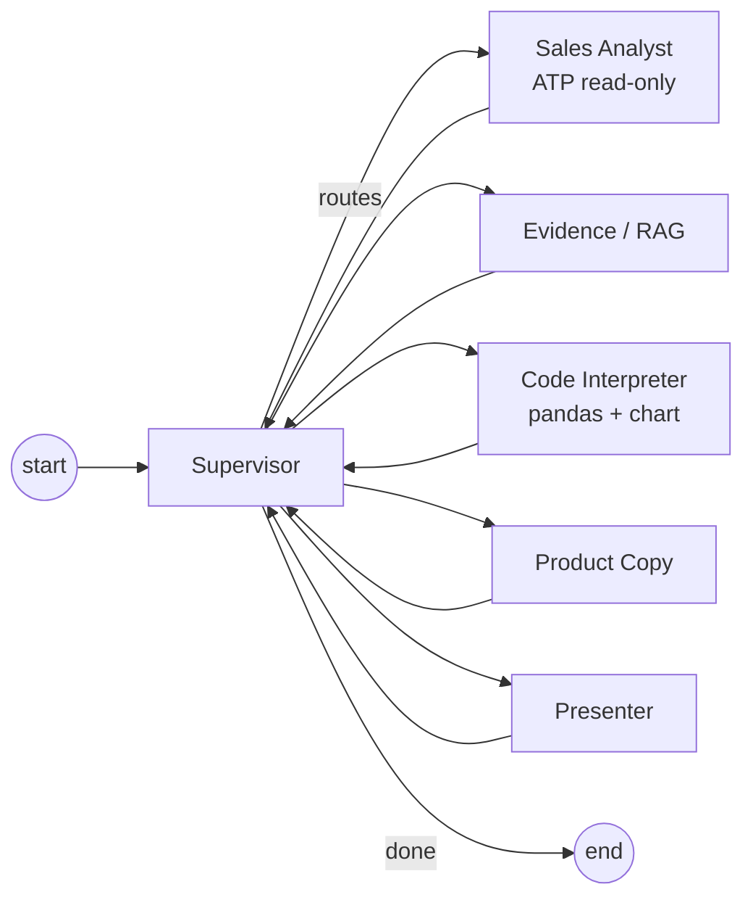

# AI Studio — agentic GenAI merchandising

!!! abstract "What this adds"
    A second, **agentic** GenAI surface alongside the single-turn [AI Assistant](assistant.md).
    The **AI Studio** runs a **LangGraph multi-agent workflow** on **OCI Generative AI** (OCI
    Enterprise AI) to produce a *merchandising brief*, and is observable end-to-end in **OCI
    APM** and **Langfuse**. It ships as a decoupled microservice (`services/genai-studio/`)
    that the shop proxies to — **off by default**, so the existing shop is unchanged unless
    `AI_STUDIO_ENABLED=true`.

This component is modelled on Dario Mandic's OCI multi-agent e-commerce demo and reuses the
OCI GenAI + Langfuse + OpenTelemetry patterns proven in the OCI Coordinator project. It uses
the **`langchain-oci` `ChatOCIGenAI`** SDK inside LangGraph nodes.

## Agents

| Agent | Maps to (Mandic) | Drone Shop role |
| --- | --- | --- |
| **Supervisor** | Supervisor | Plans and routes through the agent sequence; bounded by `STUDIO_MAX_STEPS`. |
| **Sales Analyst** | Sales Analyst (ADB) | Read-only SELECT over `orders`/`order_items`/`products` → category revenue trends. |
| **Evidence / RAG** | Evidence agent | Grounds the brief in catalog facts (+ optional web search, flag-gated). |
| **Code Interpreter** | Code Interpreter tool | Deterministic pandas/matplotlib trend chart over the sales rows. |
| **Product Copy** | Product Copy agent | Merchandising copy grounded on sales + evidence. |
| **Presenter** | Final Presenter | Assembles the final markdown brief + chart. |

## Two modes

AI Studio is **admin-only** and reached from the top nav **AI Studio** link or the admin
console → *Admin AI + Workflow Labs* → **AI Studio — Enterprise GenAI** card (`/ai-studio`).

| Mode | Endpoint | What it does | Data it reads |
| --- | --- | --- | --- |
| **Ask about your data** | `POST /api/ai-studio/ask` → studio `/api/studio/ask` | Free-form questions about **orders, products, and sales analytics**; a single **Data Analyst** agent answers, grounded on a read-only ATP snapshot | `orders`, `products`, `order_items` via the read-only `studio_ro` user |
| **Merchandising brief** | `POST /api/ai-studio/brief` → studio `/api/studio/brief` | The 6-agent merchandising workflow (supervisor + sales/evidence/code/copy/presenter) | same read-only ATP tables |

**Where answers come from.** The Data Analyst can only `SELECT` (the `studio_ro` user has no write
grants); the read query is captured on the `tool.atp_query` span (`db.statement`). The OCI GenAI
model turns your question + that snapshot into the answer — it never writes to the database and is
told to use only the provided data. The response carries `data_source` (`oracle_atp` when live,
`synthetic` with a `fallback_reason` otherwise) so you always know the provenance.

## Request flow

1. An admin opens **AI Studio** and asks a data question (or requests a brief).
2. The shop proxy (`/api/ai-studio/{ask,brief}`, admin/internal-service auth only) forwards the
   call to the studio service with W3C trace context (one continuous trace).
3. The Data Analyst (or the brief supervisor + agents) reads ATP read-only and calls OCI GenAI;
   each LLM call emits `gen_ai.*` telemetry; the run is exported to **both OCI APM and Langfuse**.
4. The studio returns `{ run_id, trace_id, data_source, agents_run, answer|brief, token_usage }`.
5. The page renders the answer and a **"Where this came from"** line: the exact path
   *shop proxy → octo-genai-studio → Data Analyst → ATP + OCI GenAI* plus the **trace id** to find
   the run in OCI APM Trace Explorer, Langfuse, and the GenAI Command Center dashboard.

See [Lab 15 — GenAI Data Q&A: full lineage](../workshop/lab-15-genai-data-qa-lineage.md) for the
step-by-step correlation walkthrough.

## Governance

The studio enforces the same drone-domain scope and prompt-injection blocks as the classic
assistant (ported `scope_decision`), caps request length, runs the Sales Analyst with a
**read-only** DB user and parameterised SELECT-only SQL, and bounds the graph recursion. The
Code Interpreter runs **trusted, repo-owned** analysis (no model-generated code execution) —
the OCI Responses-API managed sandbox is the documented hardening upgrade.

## Configuration

| Side | Key | Default | Notes |
| --- | --- | --- | --- |
| Shop | `AI_STUDIO_ENABLED` | `false` | Master flag; hides nav + returns 503 when off. |
| Shop | `AI_STUDIO_BASE_URL` | `http://genai-studio:8090` | In-network address of the studio. |
| Shop | `AI_STUDIO_INTERNAL_SERVICE_KEY` | — | Shared key the proxy presents to the studio. |
| Studio | `OCI_GENAI_MODEL_ID` | — | e.g. `meta.llama-3.3-70b-instruct` / `cohere.command-r-08-2024`. |
| Studio | `OCI_AUTH_TYPE` | `INSTANCE_PRINCIPAL` | `API_KEY` for local. |
| Studio | `LANGFUSE_BASE_URL` | — | Self-hosted Langfuse, e.g. `https://lf.<DNS_DOMAIN>`. |

See [`services/genai-studio/README.md`](https://github.com/adibirzu/octo-apm-demo/tree/main/services/genai-studio)
for the full service reference, and
[GenAI monitoring with APM + Langfuse](../observability-v2/ai-studio-genai-monitoring.md) for the
observability walkthrough.
