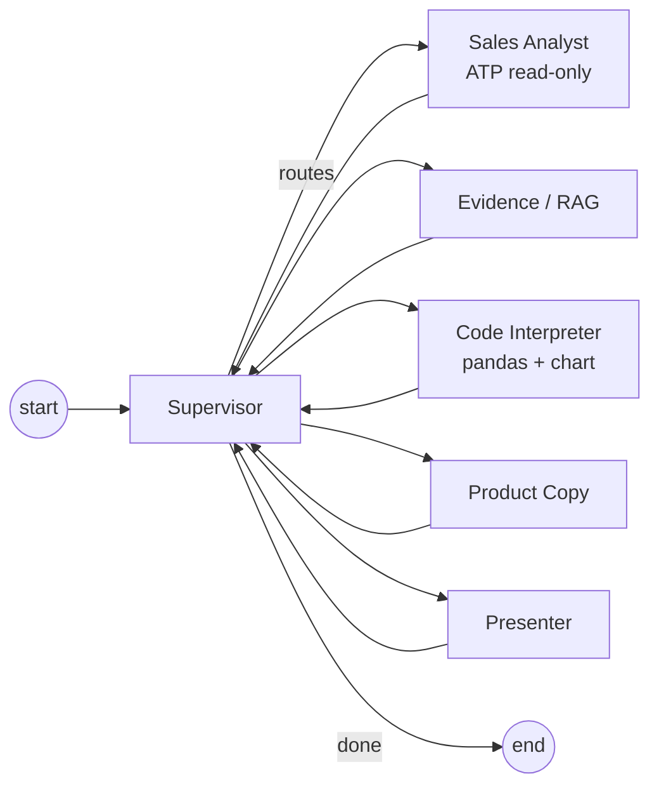

# AI Studio — agentic GenAI merchandising

!!! abstract "What this adds"
    A second, **agentic** GenAI surface alongside the single-turn [AI Assistant](assistant.md).
    The **AI Studio** runs a **LangGraph multi-agent workflow** on **OCI Generative AI** (OCI
    Enterprise AI) to produce a *merchandising brief*, and is observable end-to-end in **OCI
    APM** and **Langfuse**. It ships as a decoupled microservice (`services/genai-studio/`)
    that the shop proxies to — **off by default**, so the existing shop is unchanged unless
    `AI_STUDIO_ENABLED=true`.

This component is modelled on Dario Mandic's OCI multi-agent e-commerce demo and reuses the
OCI GenAI + Langfuse + OpenTelemetry patterns proven in the OCI Coordinator project. It uses
the **`langchain-oci` `ChatOCIGenAI`** SDK inside LangGraph nodes.

## Agents

| Agent | Maps to (Mandic) | Drone Shop role |
| --- | --- | --- |
| **Supervisor** | Supervisor | Plans and routes through the agent sequence; bounded by `STUDIO_MAX_STEPS`. |
| **Sales Analyst** | Sales Analyst (ADB) | Read-only SELECT over `orders`/`order_items`/`products` → category revenue trends. |
| **Evidence / RAG** | Evidence agent | Grounds the brief in catalog facts (+ optional web search, flag-gated). |
| **Code Interpreter** | Code Interpreter tool | Deterministic pandas/matplotlib trend chart over the sales rows. |
| **Product Copy** | Product Copy agent | Merchandising copy grounded on sales + evidence. |
| **Presenter** | Final Presenter | Assembles the final markdown brief + chart. |

## Four modes

AI Studio is **admin-only** and reached from the top nav **AI Studio** link (after signing in —
see [Admin sign-in](#admin-sign-in) below) or the admin console → *Admin AI + Workflow Labs* →
**AI Studio — Enterprise GenAI** card (`/ai-studio`). It offers four modes — **Ask about your
data**, **Ask the catalog (RAG)**, **Chat (multi-turn)**, and **Merchandising brief** — described
in the table below.

### Admin sign-in

**Quick steps — how any operator opens AI Studio:**

1. Sign in to the **CRM portal** at `https://admin.<DNS_DOMAIN>/login` with the **`admin`** account.
2. Click **AI Studio** in the left-hand nav (or go straight to `https://admin.<DNS_DOMAIN>/ai-studio`).
   Thanks to **single sign-on**, you go straight in — no second prompt.
3. *(Only if you didn't sign in to the CRM first)* you'll get the AI Studio sign-in page at
   `/ai-studio/login`; sign in with the same **`admin`** account.
4. You land on the AI Studio console. Pick a mode (see the table below): **Ask about your data**,
   **Ask the catalog (RAG)**, or **Merchandising brief**.
5. Open **GenAI Observability** (`/admin/genai-observability`) for token/cost/latency tiles and
   deep-links into OCI APM Trace Explorer and Langfuse.

!!! tip "Single sign-on (CRM → AI Studio)"
    Both apps live on the admin host and share `octo-auth/token-secret`, so a CRM login also mints
    the shop's `octo_session` cookie — one sign-in covers the CRM portal **and** AI Studio, and CRM
    logout clears both. The admin password gates the CRM; the shop independently re-checks
    `role=admin` before opening AI Studio, so non-admins are still refused. The admin password is set
    by the deployment operator via the `octo-auth/seed-admin-password` secret (env
    `SEED_ADMIN_PASSWORD`); locally, with no secret, the shop falls back to the committed default
    seed hash (dev only).

!!! note "Setting the admin password (operators)"
    The live password is never committed. An operator stores it as the
    `seed-admin-password` key of the `octo-auth` Kubernetes secret — using
    `kubectl create secret generic … --from-literal` with the value read from a
    prompt or file (so it stays out of shell history), or via your secret
    manager — then restarts the shop. `deploy/init-tenancy.sh` seeds this key
    automatically on a fresh tenancy.

AI Studio carries its own sign-in because on the admin host `/login` and `/api/auth/*` serve the
**CRM portal** (a different app). `GET /ai-studio/login` renders an admin-only sign-in page
(admin-host-only — 404 on the public storefront host). `POST /api/ai-studio/login` reuses the shop
password-login flow (rate-limit + audit), requires `role=admin`, and sets the httponly
`octo_session` cookie (secure, samesite=lax, host-scoped to the admin host). Visiting `/ai-studio`
or `/admin/genai-observability` while unauthenticated redirects the admin to `/ai-studio/login`
(not `/login`). The `admin` account password is operator-supplied at runtime (see deployment
secret) and is never committed.

| Mode | Endpoint | What it does | Data it reads |
| --- | --- | --- | --- |
| **Ask about your data** | `POST /api/ai-studio/ask` → studio `/api/studio/ask` | Free-form questions about **orders, products, and sales analytics**; a single **Data Analyst** agent answers, grounded on a read-only ATP snapshot | `orders`, `products`, `order_items` via the read-only `studio_ro` user |
| **Ask the catalog (RAG)** | `POST /api/ai-studio/rag` → studio `/api/studio/rag` | Semantic **retrieval-augmented** Q&A about products/specs/policies; the **Product Expert** embeds the question, runs an **app-side cosine** similarity search over the embeddings stored as JSON in `genai_kb` (Oracle Database 19c — no native VECTOR/`VECTOR_DISTANCE`), and answers grounded on the retrieved passages (with cosine-distance citations) | `genai_kb` (catalog + curated docs) via `studio_ro` |
| **Chat (multi-turn)** | `POST /api/ai-studio/chat` → studio `/api/studio/chat` | A conversational assistant that **remembers the session** (prior turns are replayed into the model); JSON or SSE token stream — see [Multi-turn chat](#multi-turn-chat) | in-process conversation memory; drone/shop domain |
| **Merchandising brief** | `POST /api/ai-studio/brief` → studio `/api/studio/brief` | The 6-agent merchandising workflow (supervisor + sales/evidence/code/copy/presenter) | same read-only ATP tables |

The RAG mode adds `retrieval.embed` + `vector_db.search` spans to the trace — see
[GenAI monitoring → RAG span model](../observability-v2/ai-studio-genai-monitoring.md#rag-over-the-oracle-19c-knowledge-base).
The admin **GenAI Observability** page (`/admin/genai-observability`) rolls up token/cost/
latency/judge tiles + recent runs and deep-links to APM/Langfuse/Grafana/Command Center.

**Where answers come from.** The Data Analyst can only `SELECT` (the `studio_ro` user has no write
grants); the read query is captured on the `tool.atp_query` span (`db.statement`). The OCI GenAI
model turns your question + that snapshot into the answer — it never writes to the database and is
told to use only the provided data. The response carries `data_source` (`oracle_atp` when live,
`synthetic` with a `fallback_reason` otherwise) so you always know the provenance.

## Multi-turn chat

The **Chat (multi-turn)** tab is a conversational surface (distinct from the single-shot ask/rag/brief): the studio keeps a bounded, session-scoped history and **replays prior turns into each OCI GenAI call**, so the assistant has context. Each turn is traced under `studio.chat` → `agent.invoke.chat_assistant` → `llm.invoke.chat` carrying `gen_ai.*` plus `gen_ai.conversation.id` (= the session id), so a whole conversation is one correlatable session in OCI APM and Langfuse — and shows up in the **GenAI Session Rollup** view. Set `stream=true` for an SSE token stream (the studio records time-to-first-token on the span); the admin UI uses the JSON path.

Conversation memory is process-local and bounded (last ~6 exchanges, LRU across sessions); the documented upgrade is a Redis/ATP-backed store keyed on the same session id.

## Request flow

1. An admin opens **AI Studio** and asks a data question (or requests a brief).
2. The shop proxy (`/api/ai-studio/{ask,brief}`, admin/internal-service auth only) forwards the
   call to the studio service with W3C trace context (one continuous trace).
3. The Data Analyst (or the brief supervisor + agents) reads ATP read-only and calls OCI GenAI;
   each LLM call emits `gen_ai.*` telemetry; the run is exported to **both OCI APM and Langfuse**.
4. The studio returns `{ run_id, trace_id, data_source, agents_run, answer|brief, token_usage }`.
5. The page renders the answer and a **"Where this came from"** line: the exact path
   *shop proxy → octo-genai-studio → Data Analyst → ATP + OCI GenAI* plus the **trace id** to find
   the run in OCI APM Trace Explorer, Langfuse, and the GenAI Command Center dashboard.

See [Lab 15 — GenAI Data Q&A: full lineage](../workshop/lab-15-genai-data-qa-lineage.md) for the
step-by-step correlation walkthrough.

## Governance

The studio enforces the same drone-domain scope and prompt-injection blocks as the classic
assistant (ported `scope_decision`), caps request length, runs the Sales Analyst with a
**read-only** DB user and parameterised SELECT-only SQL, and bounds the graph recursion. The
Code Interpreter runs **trusted, repo-owned** analysis (no model-generated code execution) —
the OCI Responses-API managed sandbox is the documented hardening upgrade.

## Configuration

| Side | Key | Default | Notes |
| --- | --- | --- | --- |
| Shop | `AI_STUDIO_ENABLED` | `false` | Master flag; hides nav + returns 503 when off. |
| Shop | `AI_STUDIO_BASE_URL` | `http://genai-studio:8090` | In-network address of the studio. |
| Shop | `AI_STUDIO_INTERNAL_SERVICE_KEY` | — | Shared key the proxy presents to the studio. |
| Studio | `OCI_GENAI_MODEL_ID` | — | e.g. `meta.llama-3.3-70b-instruct` / `cohere.command-r-08-2024`. |
| Studio | `OCI_AUTH_TYPE` | `INSTANCE_PRINCIPAL` | `API_KEY` for local. |
| Studio | `LANGFUSE_BASE_URL` | — | Self-hosted Langfuse, e.g. `https://lf.<DNS_DOMAIN>`. |

See [`services/genai-studio/README.md`](https://github.com/adibirzu/octo-observability-demo/tree/main/services/genai-studio)
for the full service reference, and
[GenAI monitoring with APM + Langfuse](../observability-v2/ai-studio-genai-monitoring.md) for the
observability walkthrough.
