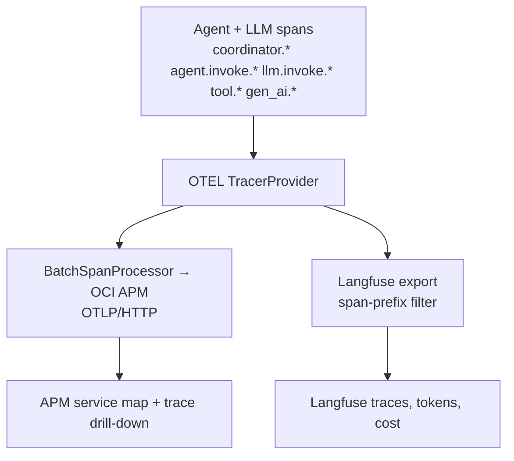
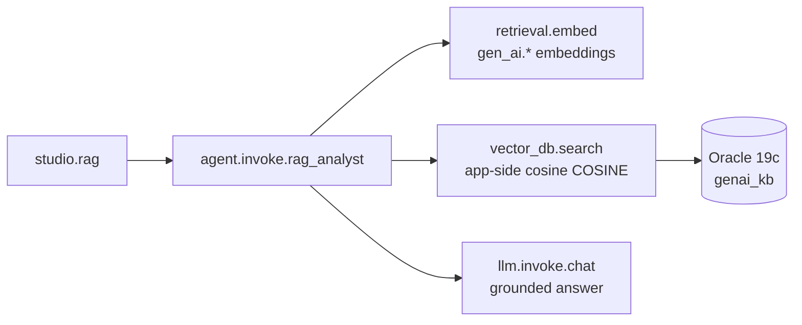

# GenAI monitoring — APM + Langfuse for the AI Studio agents

The [AI Studio](../drone-shop/ai-studio.md) multi-agent workflow is instrumented so the same
run is visible in **two complementary panes**:

- **OCI APM** — the infrastructure and topology view: one distributed trace spanning
  **shop → studio → each agent → each LLM call**, with service map, latency, and errors.
- **Langfuse** — the LLM/agent analytics view: prompts, completions, token usage, cost, and
  per-agent timing, grouped by session.

## One tracer, two consumers

A single OpenTelemetry `TracerProvider` in the studio service feeds both backends:



- The **APM exporter** uses the same endpoint shape and `Authorization: dataKey ...` header as
  the rest of the platform, but points at the dedicated `octo-ai-apm` domain so
  GenAI numeric attributes have their own activation slots while preserving
  trace-id correlation back to Shop and CRM.
- The **Langfuse filter** (`should_export_span`) only forwards spans whose names start with the
  agent-path prefixes — infra spans stay APM-only, keeping Langfuse focused on the GenAI path.
- The shop proxy forwards W3C `traceparent`, so the trace is **continuous** from the shop click
  through every agent.

## What to show in a demo

1. In **AI Studio**, generate a brief. Note the **trace id** shown with the result.
2. **OCI APM → Trace Explorer:** open that trace. Point out the fan-out:
   `ai_studio.brief` → `coordinator.supervisor` → `agent.invoke.sales_analyst`
   (`tool.atp_query`) → `retrieval.evidence` → `tool.code_interpreter` →
   `agent.invoke.product_copy` → `agent.invoke.presenter`, each `llm.invoke.*` carrying
   `gen_ai.request.model` and `gen_ai.usage.*` tokens.
3. **Langfuse** (`lf.<DNS_DOMAIN>`): open the same session/run. Show prompts, completions,
   token counts, cost, and per-agent latency — the LLM-centric view of the identical run.
4. Contrast: APM answers *"where did time/errors go across services?"*; Langfuse answers
   *"what did each agent prompt and spend?"*.

## Span attributes worth highlighting

| Attribute | Where | Meaning |
| --- | --- | --- |
| `studio.run_id` / `session.id` | every span (enrichment) | Correlate a whole run / Langfuse session. |
| `studio.agents_run` | `studio.brief` | Ordered list of agents that executed. |
| `gen_ai.request.model` | `llm.invoke.*` | OCI GenAI model used. |
| `gen_ai.usage.input_tokens` / `output_tokens` | `llm.invoke.*`, `studio.brief` | Token accounting. |
| `studio.data_source` | `tool.atp_query` | `oracle_atp` vs `synthetic` fallback. |
| `studio.guardrail.allowed` / `reason` | `studio.brief` | Scope / injection decision. |

## Dedicated AI APM domain (`octo-ai-apm`)

GenAI telemetry has its **own** APM domain — **`octo-ai-apm`** — separate from the shared
**main** APM domain that the shop, CRM, Java sidecar, and workflow gateway report to. The two
stay joined because the studio forwards the W3C `traceparent`, so a GenAI run still correlates
back to the originating shop/CRM trace by **`trace_id`** — the dedicated domain is *where the
GenAI spans live*, not a break in the trace.

The reason for the split is **numeric attribute activation**: APM only aggregates/queries
attributes that are explicitly activated as metric dimensions, and slots are finite. The
`octo-ai-apm` domain has the GenAI **numeric** attributes activated and queryable:

| Numeric attribute | Span | What it measures |
| --- | --- | --- |
| `gen_ai.usage.input_tokens` | `llm.invoke.*`, `studio.*` | Prompt tokens. |
| `gen_ai.usage.output_tokens` | `llm.invoke.*`, `studio.*` | Completion tokens. |
| `gen_ai.usage.cost_usd` | `llm.invoke.*`, `studio.*` | Enriched per-call USD cost. |
| `retrieval.documents.count` | `vector_db.search` | Passages returned for RAG grounding. |

Alongside these, the usual GenAI **string** dimensions are activated for slice/dice:
`gen_ai.agent.name`, `gen_ai.request.model`, `studio.mode`, `studio.outcome`, `studio.run_id`,
and the `ai_studio.*` set. Because they live in a dedicated domain, you can group token/cost by
model·agent·mode in APM without competing for attribute slots with the rest of the platform.

The same token/cost figures are **also** available in two other panes for cross-checking:
**Langfuse** (`lf.<DNS_DOMAIN>`) with per-model token/cost on the multi-agent trace tree, and the
in-product [GenAI Observability page](#admin-genai-observability-page) (`/admin/genai-observability`).

## OCI dashboards for GenAI

OCI APM has **no standalone dashboard objects** — dashboards live in the **OCI Management
Dashboard** service (Console → *Observability & Management → Dashboards*), which embeds APM
saved-search and Log Analytics widgets. Three importable surfaces ship for GenAI:

| Surface | File | Backed by |
| --- | --- | --- |
| **GenAI Command Center** (Management Dashboard, 11 widgets) | `deploy/oci/log_analytics/dashboards/genai-llmetry-command-center.json` | token throughput, token/cost by run·model·agent, cost-by-model FinOps, agent fan-out, Sales-Analyst data-source health, errors & guardrails, assistant LLMetry, **session/thread rollup, latency p50/p95, RAG retrieval grounding, LLM-as-judge by run** (Phase A — APM parity) |
| **GenAI APM Trace Dashboard** (Logging Analytics dashboard, 4 widgets) | `deploy/oci/log_analytics/dashboards/genai-apm-trace-dashboard.json` | trace-correlated view keyed on the same `trace_id` / `studio.run_id` as the APM saved queries `ai_studio_agent_fanout` + `ai_studio_token_cost`. Despite the name it is a Logging Analytics dashboard, not a native APM dashboard — the full native APM trace richness (waterfall, span detail, service map) lives in **APM Trace Explorer**. |
| **GenAI Tokens, Cost & Judge Scores** (OCI Monitoring) | `deploy/oci/monitoring-dashboards/genai-token-cost.json` | the `octo_genai` custom-metric namespace published by the Langfuse→OCI Monitoring sync |

Import the Management Dashboards (idempotent; creates the backing saved searches too):

```bash
# Dry-run is the default; add --apply to mutate. --skip-detection-rules imports
# only saved searches + dashboards (no LA_NAMESPACE / scheduled rules needed).
COMPARTMENT_ID=<LogAnalytics-compartment-OCID> OCI_PROFILE=<profile> \
  python deploy/oci/log_analytics/apply_saved_searches_and_dashboards.py \
  --apply --skip-detection-rules
```

The dashboards read the `octo-genai-studio` Log Source, so import them into the tenancy where
AI Studio actually runs (otherwise the tiles render empty). Tiles drill out to Langfuse
(`lf.${DNS_DOMAIN}`) and Grafana (`grafana.${DNS_DOMAIN}`) for prompt/cost detail.

On OKE, the Monitoring namespace is refreshed by the hourly
`octo-genai-langfuse-apm-sync` CronJob in `octo-drone-shop`. After deploying or
rotating credentials, create a one-off job from that CronJob to backfill the
dashboard immediately; a successful run can still publish zero-valued aggregates
when Langfuse has no recent generations in the queried window.

## RAG over the Oracle 19c knowledge base

The **Ask the catalog (RAG)** mode answers product/spec/policy questions with
retrieval-augmented generation over an Oracle 19c knowledge base
(`genai_kb`: catalog rows + curated drone docs). The live ATP is Oracle 19c with
**app-side cosine similarity** (`vector.engine=appside_cosine`) over embeddings stored
as JSON text in a CLOB — there is no Oracle 23ai native `VECTOR` type or `VECTOR_DISTANCE`.
It is the in-product realisation of
Oracle's *"Observability on RAG solutions using OCI APM"* pattern and the
`oci-quickstart` `genai-inference-app-monitoring` example — every retrieval step is a
span, so the cost and grounding of RAG are visible, not hidden.

### The RAG span model



| Span | Key attributes | Why it matters |
| --- | --- | --- |
| `retrieval.embed` | `gen_ai.system`, `gen_ai.request.model`, `embedding.dimension` | The embedding call has its own cost/latency, separate from generation. |
| `vector_db.search` | `db.system=oracle.atp`, `vector.engine=appside_cosine`, `vector.metric=COSINE`, `vector.top_k`, `retrieval.documents.count`, `retrieval.top_distance` | Proves *which* passages grounded the answer and how close they were (cosine ranked app-side over CLOB-stored JSON embeddings). |
| `llm.invoke.chat` | `gen_ai.request.model`, `gen_ai.usage.*` | The generation grounded on retrieved context. |

The answer carries `data_source` (`oracle_atp` when the KB is live, otherwise a
labelled fallback with `fallback_reason`) and `citations` (title + source + cosine
distance) so retrieval is auditable from the UI as well as the trace.

### Enabling RAG

1. Run the migration once as the schema owner (creates `genai_kb` + grants `SELECT`
   to `studio_ro`): `services/genai-studio/db/migrations/genai_kb.sql`.
2. Seed embeddings (writeable user, never `studio_ro`): `python -m scripts.seed_genai_kb`.
3. Set `STUDIO_RAG_ENABLED=true` (+ `OCI_GENAI_EMBED_MODEL_ID`, `STUDIO_EMBED_DIM`). RAG
   degrades to a labelled fallback when off or the KB is unseeded — it never breaks the
   existing modes.

## Multi-turn chat telemetry

The chat surface adds `studio.chat` (mode=chat) → `agent.invoke.chat_assistant` → `llm.invoke.chat` spans. Each carries `gen_ai.conversation.id` (the session id), `gen_ai.request.turns` (history depth replayed), and — when streamed — `gen_ai.response.time_to_first_token_ms`. Because conversations are grouped by `session.id`, the **GenAI Session Rollup** Log Analytics search (Phase A) shows tokens/cost/agents per conversation, and the same `trace_id` follows each turn into Langfuse.

## Admin GenAI Observability page

`/admin/genai-observability` is an in-product single pane (admin-only) that **uses the
collected telemetry**: it calls the studio's `/api/studio/metrics/summary` (via the shop
proxy `/api/ai-studio/metrics`), which aggregates the Langfuse analytics into live tiles
(total tokens, estimated cost, latency p50/p95, judge-score average) and a recent-generations
table. Each row and the trace-lookup box deep-link to **OCI APM**, **Langfuse**, **Grafana**,
and the **GenAI Command Center** dashboard. All deep-link targets are env-driven
(`APM_CONSOLE_URL`, `LANGFUSE_DASHBOARD_URL`, `GENAI_GRAFANA_URL`, `GENAI_COMMAND_CENTER_URL`)
— no tenancy or IP is baked into the page.

See [Lab 16 — GenAI RAG retrieval lineage](../workshop/lab-16-genai-rag-retrieval-lineage.md).

## Enabling

Set on the studio: `OCI_APM_ENDPOINT` + `OCI_APM_PRIVATE_DATA_KEY` from
`octo-apm-ai`, `LANGFUSE_BASE_URL` + `LANGFUSE_PUBLIC_KEY` +
`LANGFUSE_SECRET_KEY` from `octo-llmetry`, and
`OCI_MONITORING_COMPARTMENT_ID` + `OCI_REGION` from `octo-oci-config`. The
shop also keeps LLMetry/Langfuse controls in `octo-llmetry` for the classic
assistant path. Either APM or Langfuse is independently optional — with neither
configured the studio still runs and traces to the console.

For the production OKE, validate the local kubeconfig before changing runtime
secrets: the active context's OCI exec stanza must include `--profile <OCI_PROFILE>`,
and `kubectl auth can-i get pods -n octo-drone-shop` should return `yes`.
Topology and credential values stay in environment variables, ignored tfvars,
or OCI/Kubernetes secrets; committed docs and manifests only use placeholders.
Validate in a staging tenancy before enabling against the production APM domain.
