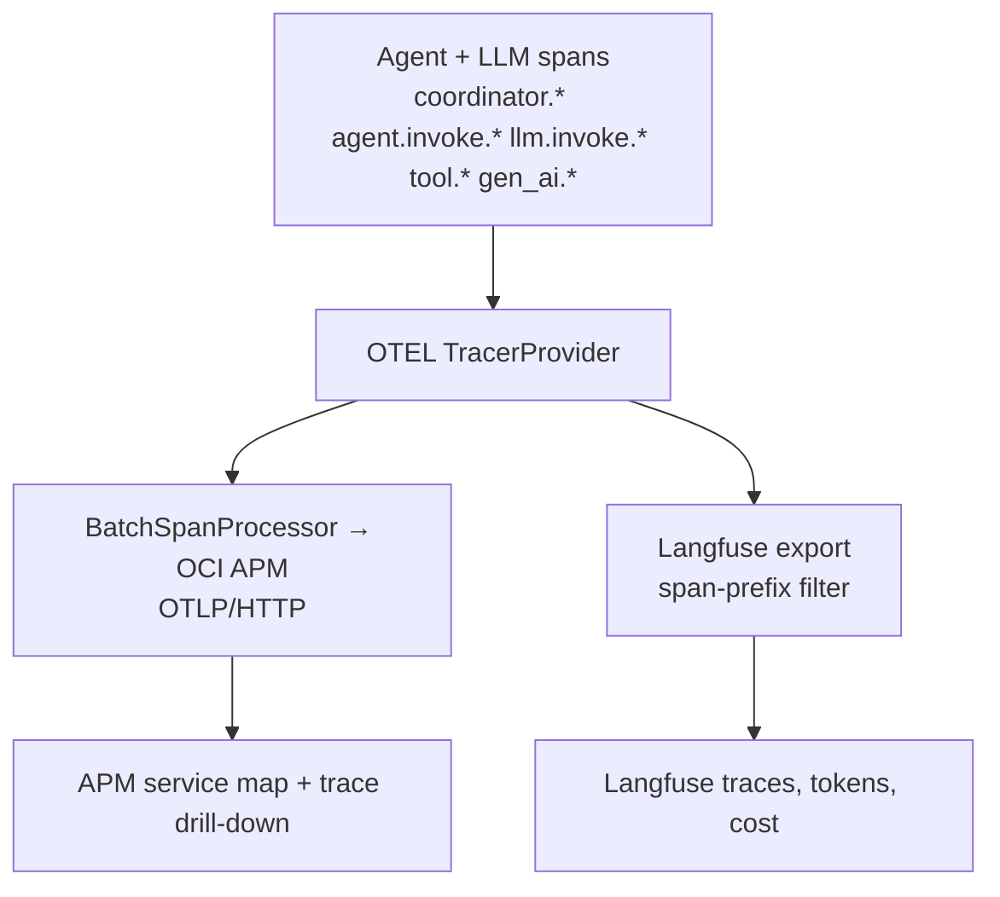

# GenAI monitoring — APM + Langfuse for the AI Studio agents

The [AI Studio](../drone-shop/ai-studio.md) multi-agent workflow is instrumented so the same
run is visible in **two complementary panes**:

- **OCI APM** — the infrastructure and topology view: one distributed trace spanning
  **shop → studio → each agent → each LLM call**, with service map, latency, and errors.
- **Langfuse** — the LLM/agent analytics view: prompts, completions, token usage, cost, and
  per-agent timing, grouped by session.

## One tracer, two consumers

A single OpenTelemetry `TracerProvider` in the studio service feeds both backends:



- The **APM exporter** uses the same endpoint shape and `Authorization: dataKey …` header as
  the rest of the platform, so studio spans land in the same APM domain and correlate by trace id.
- The **Langfuse filter** (`should_export_span`) only forwards spans whose names start with the
  agent-path prefixes — infra spans stay APM-only, keeping Langfuse focused on the GenAI path.
- The shop proxy forwards W3C `traceparent`, so the trace is **continuous** from the shop click
  through every agent.

## What to show in a demo

1. In **AI Studio**, generate a brief. Note the **trace id** shown with the result.
2. **OCI APM → Trace Explorer:** open that trace. Point out the fan-out:
   `ai_studio.brief` → `coordinator.supervisor` → `agent.invoke.sales_analyst`
   (`tool.atp_query`) → `retrieval.evidence` → `tool.code_interpreter` →
   `agent.invoke.product_copy` → `agent.invoke.presenter`, each `llm.invoke.*` carrying
   `gen_ai.request.model` and `gen_ai.usage.*` tokens.
3. **Langfuse** (`lf.octodemo.cloud`): open the same session/run. Show prompts, completions,
   token counts, cost, and per-agent latency — the LLM-centric view of the identical run.
4. Contrast: APM answers *"where did time/errors go across services?"*; Langfuse answers
   *"what did each agent prompt and spend?"*.

## Span attributes worth highlighting

| Attribute | Where | Meaning |
| --- | --- | --- |
| `studio.run_id` / `session.id` | every span (enrichment) | Correlate a whole run / Langfuse session. |
| `studio.agents_run` | `studio.brief` | Ordered list of agents that executed. |
| `gen_ai.request.model` | `llm.invoke.*` | OCI GenAI model used. |
| `gen_ai.usage.input_tokens` / `output_tokens` | `llm.invoke.*`, `studio.brief` | Token accounting. |
| `studio.data_source` | `tool.atp_query` | `oracle_atp` vs `synthetic` fallback. |
| `studio.guardrail.allowed` / `reason` | `studio.brief` | Scope / injection decision. |

## OCI dashboards for GenAI

OCI APM has **no standalone dashboard objects** — dashboards live in the **OCI Management
Dashboard** service (Console → *Observability & Management → Dashboards*), which embeds APM
saved-search and Log Analytics widgets. Three importable surfaces ship for GenAI:

| Surface | File | Backed by |
| --- | --- | --- |
| **GenAI Command Center** (Management Dashboard, 11 widgets) | `deploy/oci/log_analytics/dashboards/genai-llmetry-command-center.json` | token throughput, token/cost by run·model·agent, cost-by-model FinOps, agent fan-out, Sales-Analyst data-source health, errors & guardrails, assistant LLMetry, **session/thread rollup, latency p50/p95, RAG retrieval grounding, LLM-as-judge by run** (Phase A — APM parity) |
| **GenAI APM Trace Dashboard** (Management Dashboard, 4 widgets) | `deploy/oci/log_analytics/dashboards/genai-apm-trace-dashboard.json` | trace-correlated view keyed on the same `trace_id` / `studio.run_id` as the APM saved queries `ai_studio_agent_fanout` + `ai_studio_token_cost` |
| **GenAI Tokens, Cost & Judge Scores** (OCI Monitoring) | `deploy/oci/monitoring-dashboards/genai-token-cost.json` | the `octo_genai` custom-metric namespace published by the Langfuse→OCI Monitoring sync |

Import the Management Dashboards (idempotent; creates the backing saved searches too):

```bash
# Dry-run is the default; add --apply to mutate. --skip-detection-rules imports
# only saved searches + dashboards (no LA_NAMESPACE / scheduled rules needed).
COMPARTMENT_ID=<LogAnalytics-compartment-OCID> OCI_PROFILE=<profile> \
  python deploy/oci/log_analytics/apply_saved_searches_and_dashboards.py \
  --apply --skip-detection-rules
```

The dashboards read the `octo-genai-studio` Log Source, so import them into the tenancy where
AI Studio actually runs (otherwise the tiles render empty). Tiles drill out to Langfuse
(`lf.${DNS_DOMAIN}`) and Grafana (`grafana.${DNS_DOMAIN}`) for prompt/cost detail.

## Enabling

Set on the studio: `OCI_APM_ENDPOINT` + `OCI_APM_PRIVATE_DATA_KEY` (APM) and
`LANGFUSE_BASE_URL` + `LANGFUSE_PUBLIC_KEY` + `LANGFUSE_SECRET_KEY` (Langfuse). Either pane is
independently optional — with neither configured the studio still runs and traces to the
console. Validate in a staging tenancy before enabling against the production APM domain.
