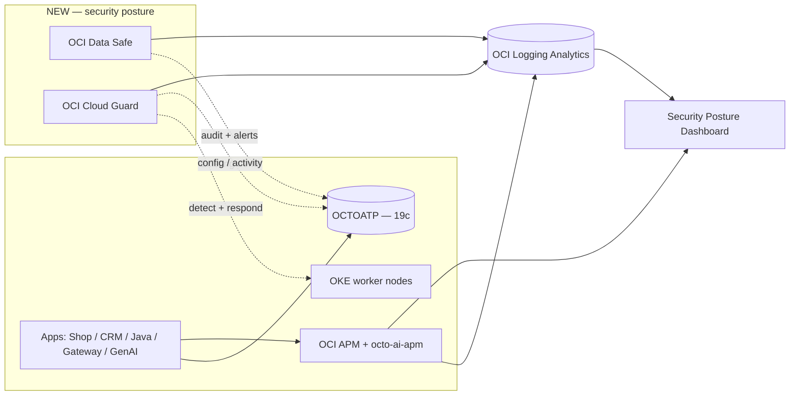

# Data Safe + Cloud Guard

This page describes the **next modular expansion** of the demo: adding OCI
**Data Safe** (database security) and OCI **Cloud Guard** (cloud security
posture + instance security). It is a **plan** — these components are additive
and feature-flagged, and the live demo is unchanged until an operator opts in.

The existing [Security Events](../observability/security.md) page already covers
the application-edge security surface (MITRE ATT&CK / OWASP attack spans, OCI
WAF, Security Zones, Vault, VSS) and mentions Cloud Guard at a high level. This
page turns that mention into a deployable, demonstrable layer and adds the
database-security half with Data Safe.

## Why this expansion

The demo's strength today is **observability** across three layers — the
application (OCI APM + RUM), the database (`OCTOATP` with OPS Insights and
Database Management), and GenAI (the dedicated `octo-ai-apm` domain plus
Langfuse). Everything correlates through stable identifiers in OCI Logging
Analytics.

The missing layer is **security posture**: is the database being misused, is
sensitive data exposed, are cloud resources configured safely, and are the OKE
worker nodes drifting from a secure baseline? Data Safe and Cloud Guard answer
exactly those questions — and they feed their findings into the **same Logging
Analytics + dashboard story** the demo already tells.

| Service | Secures | Demonstrates |
|---|---|---|
| **OCI Data Safe** | The `OCTOATP` Autonomous Database | Activity auditing, Security Assessment, User Assessment, sensitive-data discovery, and masking on a clone. |
| **OCI Cloud Guard** | The project compartment + OKE compute | Configuration / Activity / Threat detectors, instance security on worker nodes, and responder-driven remediation. |

## How it fits

Cloud Guard watches posture and compute from above; Data Safe watches the
database from beside it. Both drain into the same `<LA_NAMESPACE>` the app, DB,
and GenAI signals already use, so one dashboard can line up a trace, a slow SQL
span, a Data Safe alert, and a Cloud Guard problem on a single timeline.



## Modular, additive deployment

Everything lives under the existing `deploy/terraform/modules/security/`
directory as two new self-contained submodules — the existing quarantine-NSG +
auto-remediation code is left unchanged:

```
deploy/terraform/modules/security/
├── main.tf          # existing — UNCHANGED
├── data_safe/       # NEW — Data Safe target registration for OCTOATP
└── cloud_guard/     # NEW — Cloud Guard target + detector/responder recipes
```

The root stack wires them in with the same gated, off-by-default pattern as
`create_atp` / `create_vault` / `create_logging`:

```hcl
variable "create_data_safe"   { type = bool, default = false }
variable "create_cloud_guard" { type = bool, default = false }
variable "cloud_guard_auto_remediate" { type = bool, default = false }
```

Because the flags default to `false`, a `terraform plan` on any existing deploy
shows **no changes** until an operator turns them on. Disabling a flag removes
only the new resources. This honors the demo's additive, non-breaking contract.

## Observability tie-in

The findings do not become a second silo — they correlate with the existing
APM / Log Analytics story:

- **Data Safe alerts** → drained via a Service Connector into Logging Analytics
  under an `octo-datasafe` source. A "risky grant" or "audit gap" alert sits on
  the same timeline as the APM SQL span (`DbOracleSqlId`) for `OCTOATP`.
- **Cloud Guard problems** → exported via Event Rule → Notification → Service
  Connector into Logging Analytics under an `octo-cloudguard` source. Each
  problem carries the offending resource OCID, so it pivots straight to the
  resource the APM topology already shows.
- **Security Posture dashboard** — a new Logging Analytics dashboard with tiles
  for Cloud Guard problems by risk, Data Safe alerts by feature, the `OCTOATP`
  Security Assessment risk-score trend, top risky users, and a correlation
  panel keyed on `compartment` + resource OCID that joins security findings with
  the existing APM error-rate tiles.

The demo's signature move is preserved: **one identifier, many surfaces** — now
spanning observability *and* security.

## Phased rollout

| Phase | What turns on | What it demonstrates |
|---|---|---|
| **1 — Enablement** | `create_data_safe`, `create_cloud_guard` on; responders notify-only | Database risk score + audit trail + live cloud-posture problems, all on one dashboard alongside the APM/LogAn story. |
| **2 — Detectors** | Sensitive-data discovery, masking on an `OCTOATP_MASKDEMO` clone, tuned detector recipes | Cloud Guard flags a deliberately mis-configured resource; Data Safe shows which customer-PII columns exist and how masking neutralizes them. |
| **3 — Auto-remediation** | `cloud_guard_auto_remediate = true` | A closed detect → respond → verify loop (reusing the existing remediation topic/function), correlated end-to-end in Logging Analytics. |

## Guardrails

- **Plan only** — no live changes. Any apply is staged in **cap (staging)**
  first, reviewed, then promoted to `emdemo` within the `LogAnalytics`
  compartment scope.
- **Masking on clones only** — sensitive-data masking runs against
  `OCTOATP_MASKDEMO`, never the live shared database.
- **Redaction** — all examples use placeholders (`<COMPARTMENT_OCID>`,
  `<APM_DOMAIN_ID>`, `<LA_NAMESPACE>`, `<DNS_DOMAIN>`); no real OCIDs, IPs, or
  datakeys.

## Related pages

- [Security Events](../observability/security.md) — current security surface this expands.
- [Observability Overview](../observability/index.md) — the MELTS + correlation story this plugs into.
- [Enhancement Plan](../observability/enhancement-plan.md) — the rollout pattern this plan follows.
