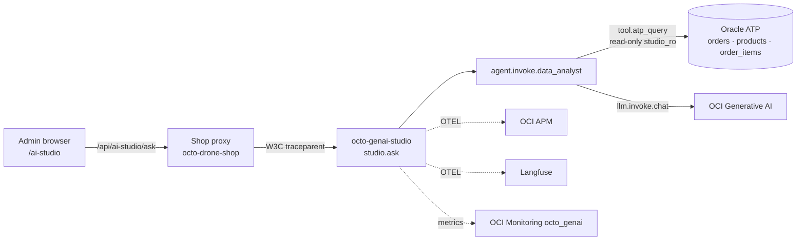

# Lab 15 — GenAI Data Q&A: full workflow & lineage

!!! info "Lab Facts"
    - **Time:** 30 minutes
    - **Surface:** AI Studio (admin), OCI APM, Langfuse, OCI Monitoring / Management Dashboards
    - **Prereqs:** admin login; AI Studio enabled (`AI_STUDIO_ENABLED=true`); observability stack + GenAI dashboards imported (Labs 12–14)

## Objective

Ask a free-form question about **orders, products, and analytics**, get a grounded answer
from the GenAI Data Analyst, and then **prove where the answer came from** — following the
exact same `trace_id` through OCI APM, Langfuse, and the GenAI dashboards.

## The data lineage (what you're about to trace)



The answer is grounded **only** on a read-only ATP snapshot (the `studio_ro` user can `SELECT`
on `orders`, `products`, `order_items` — nothing else). The LLM turns your question + that data
into the answer; it cannot write to the database.

## Steps

### 1. Find AI Studio (it's admin-only)

Sign in as admin. AI Studio appears two ways:

- Top nav **AI Studio** (shown only to admins / when configured), or
- Admin console → **Admin AI + Workflow Labs** → **AI Studio — Enterprise GenAI** card → *Open AI Studio*.

Direct URL: `${OCTO_LIVE_ADMIN_URL}/ai-studio`.

### 2. Ask about your data

On the **Ask about your data** tab, ask e.g.:

- `How many orders do we have and what is the total revenue?`
- `Which products are low on stock?`
- `What are the top selling products by units?`

Click **Ask the Data Analyst**. The result panel shows the **answer**, plus the
**Run id**, **Trace id**, **Data source** (`oracle_atp` when live), and a one-line *"Where this
came from"* lineage. Copy the **Trace id**.

### 3. Follow it in OCI APM

```text
OCI Console → Observability & Management → Application Performance Monitoring → Trace Explorer
```

Search the trace id (or filter `ServiceName = 'octo-genai-studio'`). Confirm the waterfall:
`ai_studio.ask` (shop proxy) → `studio.ask` → `agent.invoke.data_analyst` →
`tool.atp_query` (the read-only SELECT) → `llm.invoke.chat` (carrying
`gen_ai.request.model` + `gen_ai.usage.*` tokens). This is the proof of *where the answer came from*.

### 4. Same run in Langfuse

Open `https://langfuse.${DNS_DOMAIN}` → the same session/run. Inspect the prompt (your question +
the JSON data snapshot), the completion, tokens, and cost.

### 5. Tokens & cost on the GenAI dashboards

- **OCI Management Dashboard → GenAI Command Center** — token throughput, cost by model,
  agent fan-out, and the **Sales Analyst data source (ATP vs synthetic)** health tile.
- **OCI Monitoring → OCTO GenAI — Tokens, Cost & Judge Scores** — the `octo_genai` metric series.

## What you should see

- A grounded answer citing real figures (when `data_source = oracle_atp`).
- One continuous APM trace `ai_studio.ask → studio.ask → data_analyst → tool.atp_query → llm.invoke.chat`.
- The identical trace/run in Langfuse with prompt + tokens.
- `db.statement` on `tool.atp_query` showing the read-only SELECT — so there is no ambiguity about the source.

## Verify

```bash
# From inside the studio pod (or via the shop proxy with the admin/internal key):
curl -s -X POST "$STUDIO/api/studio/ask" -H 'content-type: application/json' \
  -H "x-internal-service-key: $KEY" \
  -d '{"question":"How many orders and total revenue?","session_id":"lab15"}' | jq '{status,data_source,trace_id}'
# expect: status=ok, data_source=oracle_atp, a 32-hex trace_id
```

## Troubleshooting

| Symptom | Cause | Fix |
| --- | --- | --- |
| Can't find AI Studio | Not admin / flag off | Sign in as admin; `AI_STUDIO_ENABLED=true` |
| `data_source = synthetic` | ATP read-only path failing | Check `studio.data_source.fallback_reason` on `tool.atp_query`; verify the `studio_ro` user + `octo-atp-readonly` secret |
| Refused by guardrails | Off-topic question | Ask about orders/products/analytics |
| No tokens on dashboard | Sync not run | Run `python -m app.sync.langfuse_apm_sync --once` |

## Read More

- [AI Studio](../drone-shop/ai-studio.md)
- [GenAI monitoring (APM + Langfuse)](../observability-v2/ai-studio-genai-monitoring.md)
