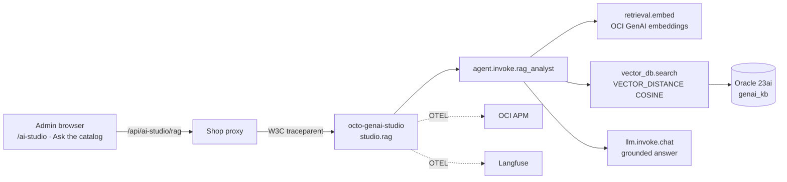

# Lab 16 — GenAI RAG retrieval lineage

!!! info "Lab Facts"
    - **Time:** 30 minutes
    - **Surface:** AI Studio (admin), Admin GenAI Observability page, OCI APM, Langfuse
    - **Prereqs:** admin login; AI Studio enabled; RAG enabled (`STUDIO_RAG_ENABLED=true`) with `genai_kb` seeded (Labs 12–15 for the observability stack)

## Objective

Ask a **product / spec / policy** question, get a retrieval-augmented answer grounded
on the Oracle 23ai knowledge base, and **prove which passages grounded it** — following
the `retrieval.embed → vector_db.search → llm.invoke.chat` pipeline through OCI APM and
Langfuse, then watch the run land on the admin **GenAI Observability** page.

## The RAG lineage (what you're about to trace)



The answer is grounded **only** on the retrieved passages (read through the read-only
`studio_ro` user). The cosine distance of each passage is on the `vector_db.search` span
and in the UI citations — so there is no ambiguity about what the model used.

## Steps

### 1. Open AI Studio → "Ask the catalog (RAG)"

Sign in as admin → **AI Studio** (top nav or admin console → *Admin AI + Workflow Labs*).
Select the **Ask the catalog (RAG)** tab and ask, e.g.:

- `Which drone is best for thermal mapping and night search & rescue?`
- `What is the returns policy?`
- `RTK vs PPK — which should I choose for corridor mapping?`

Click **Ask the Product Expert**. The result panel shows the **answer**, the
**Retrieved sources** list (title · source · cosine distance), and the **Trace id**.
Copy the trace id.

### 2. Follow the retrieval in OCI APM

```text
OCI Console → Observability & Management → Application Performance Monitoring → Trace Explorer
```

Search the trace id. Confirm the waterfall:
`ai_studio.rag` → `studio.rag` → `agent.invoke.rag_analyst` →
`retrieval.embed` → `vector_db.search` → `llm.invoke.chat`. Open `vector_db.search`
and read `retrieval.documents.count`, `retrieval.top_distance`, `vector.top_k`, and
`db.statement` (the `VECTOR_DISTANCE(..., COSINE)` shape). This is the proof of *which
passages grounded the answer*.

### 3. Same run in Langfuse

Open Langfuse → the same run. Inspect the prompt (your question + the retrieved
context block), the completion, tokens, and cost.

### 4. Watch it on the admin GenAI Observability page

```text
Admin console → Admin AI + Workflow Labs → GenAI Observability →
```

Direct URL: `${OCTO_LIVE_ADMIN_URL}/admin/genai-observability`. Your run appears in
**Recent generations** with tokens, cost, and latency; the tiles roll up token
throughput, spend, latency p50/p95, and judge-score average for the window. Paste your
trace id into **Find a run by trace id** to jump to APM or Langfuse.

## What you should see

- A grounded answer with **citations** carrying cosine distances.
- One continuous APM trace with a distinct `retrieval.embed` and `vector_db.search` span.
- The identical run in Langfuse with the retrieved-context prompt + tokens.
- The run on the admin **GenAI Observability** page, with working deep links.

## Verify

```bash
# From the shop proxy with the admin/internal key:
curl -s -X POST "$SHOP/api/ai-studio/rag" -H 'content-type: application/json' \
  -H "x-internal-service-key: $KEY" \
  -d '{"question":"best drone for thermal mapping?","session_id":"lab16"}' \
  | jq '{status,data_source,retrieved_count,trace_id}'
# expect: status=ok, data_source=oracle_atp, retrieved_count>=1, a 32-hex trace_id
```

## Troubleshooting

| Symptom | Cause | Fix |
| --- | --- | --- |
| `data_source != oracle_atp`, `retrieved_count=0` | KB not seeded / RAG off / not 23ai | Run the migration + `seed_genai_kb`; set `STUDIO_RAG_ENABLED=true`; confirm 23ai |
| No `vector_db.search` span | Falling back before retrieval | Check `studio.data_source.fallback_reason` on `agent.invoke.rag_analyst` |
| Empty tiles on the obs page | Langfuse not configured | Set `LANGFUSE_*`; the page shows zeros + a note when unconfigured |
| Refused by guardrails | Off-topic question | Ask about drones/products/specs/policies |

## Read More

- [AI Studio](../drone-shop/ai-studio.md)
- [GenAI monitoring (APM + Langfuse)](../observability-v2/ai-studio-genai-monitoring.md)
- [Lab 15 — GenAI Data Q&A: full lineage](lab-15-genai-data-qa-lineage.md)
